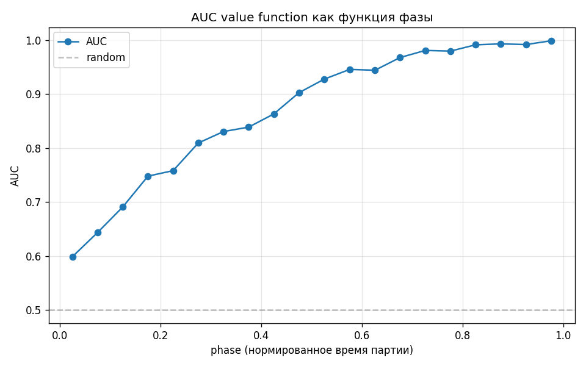
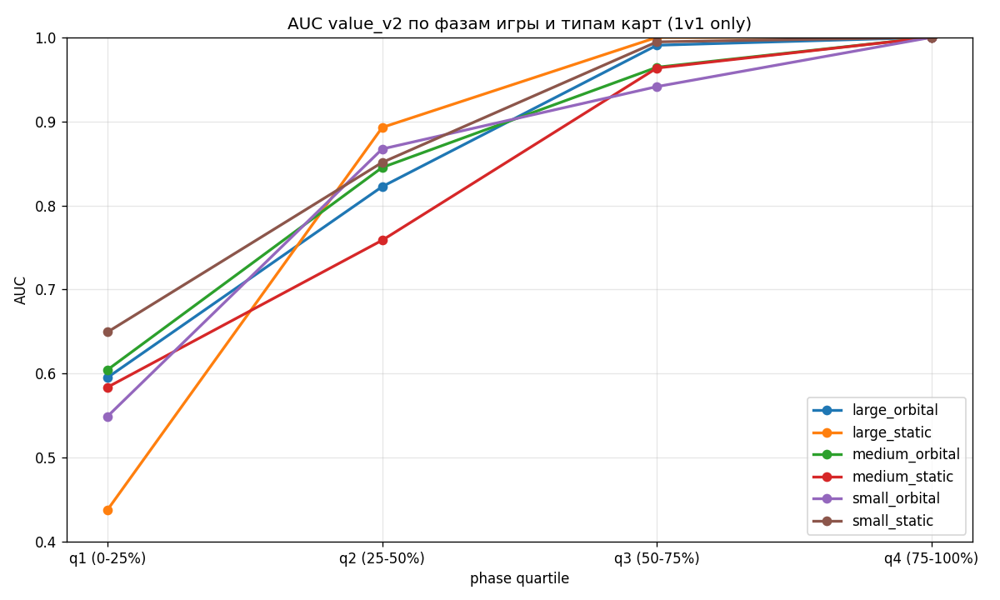
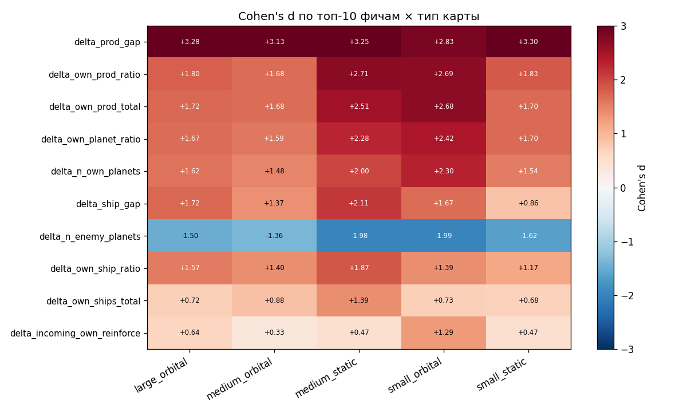

# OrbitWW — обучение на реплеях для агента Kaggle Orbit Wars

Эвристический агент для соревнования [Kaggle Orbit Wars](https://www.kaggle.com/competitions/orbit-wars) и исследовательский пайплайн, который учится на 500 реплеях чужих партий и пытается перенести выученное обратно в агента.

**Главный результат — отрицательный, и он проверен.** Listwise-ранжировщик воспроизводит выбор цели сильных игроков втрое точнее эвристики (top-1 `0.207` против `0.064`), но встроенный в агента как residual не даёт выигрыша в самой игре: winrate `0.400` на 30 парных матчах, `p = 0.58`. Разрыв между «модель лучше предсказывает» и «агент лучше играет» — центральный сюжет этого репозитория.

Второй по значимости результат: [аудит собственного пайплайна](opponent_learning/AUDIT.md), который нашёл в первой версии data leakage и эндогенность и заставил переделать всё заново. Два уже сделанных вывода после диагностики были отозваны как артефакты — это зафиксировано в отчётах, а не подчищено.

---

## Оглавление

- [Задача](#задача)
- [Что сделано](#что-сделано)
- [Результаты](#результаты)
- [Структура репозитория](#структура-репозитория)
- [Как запустить](#как-запустить)
- [Данные](#данные)
- [Что не получилось и что дальше](#что-не-получилось-и-что-дальше)

---

## Задача

Orbit Wars — соревнование из раздела Kaggle Simulations. Планеты вращаются по орбитам, каждая производит корабли, флот запускается с упреждением по подвижной цели, столкновение решается арифметикой сил. Играют 2 или 4 агента, партия — 150–300 шагов.

Из этого следуют два свойства, которые определили всю работу:

1. **Пространство действий комбинаторное**: на каждом шаге — выбор источника, цели и числа кораблей, плюс возможность не делать ничего. Классификация «одно действие из N» здесь не работает, нужно ранжирование кандидатов.
2. **Награда приходит один раз в конце.** Промежуточного сигнала нет, поэтому оценка состояния (value function) строится отдельно и проверяется отдельно от политики.

## Что сделано

### 1. Симулятор и эвристический агент

`agent_bundle/orbit_sim.py` — независимая реализация физики игры: шаг `launch → production → fleet move → rotate → combat`, сериализация состояния, генерация синтетических карт по seed, граф связности планет с четырьмя вариантами весов рёбер. Симулятор синхронен с движком Kaggle — это проверяется прогоном реального действия из реплея и сравнением со следующим состоянием.

Поверх него — эвристический агент: проекция флотов, зонирование карты, планирование атак, нацеливание с упреждением, адаптивный режим (`behind / parity / ahead / dominate`). Веса зон подбирались grid search и байесовской оптимизацией.

### 2. Пайплайн обучения на реплеях

`opponent_learning/` — парсинг 500 реплеев Kaggle в per-step датасет, признаки трёх уровней (сырые атомы → внутренние признаки планеты → парные и контекстные), value function, imitation learning на выборе цели.

### 3. Аудит и переделка

Первая версия пайплайна давала подозрительно хорошие метрики. [`AUDIT.md`](opponent_learning/AUDIT.md) разбирает почему:

| Проблема | Где |
|---|---|
| `train_test_split` по строкам, а не по эпизодам — соседние шаги партии попадали и в train, и в test | `05_train_imitation.py` |
| Value function получала на вход признаки собственного действия игрока и `phase` — предсказывала не «кто выигрывает», а «кто выиграл» | `10_value_function.py` |
| Кластеризация «стилей» кодировала исход партии, а не стиль | `clusters.json` |
| Датасет смешивал 1v1 и FFA-4 — отсюда асимметрия 31% побед / 69% поражений | весь пайплайн |

`opponent_learning/rebuild/` — переделанный пайплайн, 40 пронумерованных скриптов. Правило: сюда попадает только то, что прошло аудит; в заголовке каждого скрипта написано, какой пункт аудита он закрывает.

## Результаты

### Value function: честные метрики после удаления утечек

Убраны 9 признаков действия и `phase`, split по эпизодам, добавлены тривиальные бейзлайны для измерения lift.

| Модель | AUC | Brier | Accuracy |
|---|---|---|---|
| константный winrate | — | 0.213 | 0.692 |
| linear (5 макро-признаков) | 0.9039 | 0.1111 | 0.837 |
| xgboost (5 макро-признаков) | 0.9054 | 0.1096 | 0.843 |
| **value_v2 (полный набор)** | **0.9063** | **0.1091** | **0.844** |

`n = 54 184` (val split, 75 эпизодов).

Ключевое наблюдение здесь не AUC, а **lift: +0.0009 над xgboost на пяти макро-признаках**. Весь остальной инженерный набор признаков не добавляет почти ничего сверх разницы в производстве и числе кораблей. Это закрыло целое направление работы.

### Неопределённость исхода падает плавно, без фазового перехода



AUC растёт монотонной S-кривой с `0.60` в начале партии до `0.99` в конце. Изначальная гипотеза о резком фазовом переходе и «критическом замедлении» **не подтвердилась**: дисперсия `V` монотонна, бимодальность распределения оказалась boundary-эффектом свёртки `mode='same'` и исчезала при обрезке 10% краёв партии.

Разрез по типам карт показывает то же самое, устойчиво:



Практический вывод: партия решается около `phase ≈ 0.40 ± 0.20`, а после `phase ≈ 0.55` данные — эндшпильный шум, непригодный для обучения политике.

### Что отличает победителей: размер эффекта, а не значимость



Стратификация по типу карты, чтобы отделить реальный эффект от смешения. Разрыв в производстве (`delta_prod_gap`, Cohen's d ≈ +3.0) доминирует на всех типах карт — и это ровно тот признак, который уже есть в эвристике.

### Ранжирование действий: модель учится, агент — нет

Listwise-ранжировщик на choice sets из реплеев, задача — угадать, какую планету атаковал сильный игрок:

| Модель | top-1 | top-3 | top-5 | медианный ранг |
|---|---|---|---|---|
| эвристика (priority) | 0.064 | 0.172 | 0.271 | 12 |
| **linear listwise** | **0.207** | **0.402** | **0.505** | **5** |

`n = 93 621` train + `18 671` val.

Дальше — интеграция обученных весов в агента как residual к приоритету зон и **парный турнир на общих seed'ах со свапом сторон**:

| | значение |
|---|---|
| матчей | 30 (15 seed × 2 стороны) |
| winrate ML-версии | 0.400 |
| средняя разница по кораблям | −338 |
| t-статистика | −0.56 |
| p-value | 0.58 |

Улучшение в ранжировании не переносится в силу игры. Правдоподобные причины: ранжировщик оптимизирует одношаговое совпадение с профи, а не исход партии; выборка целей эвристики отличается от той, из которой выбирал профи; 30 матчей при std = 3333 по разнице кораблей просто не имеют мощности отличить умеренный эффект от нуля.

## Структура репозитория

```
agent_bundle/                    симулятор игры + базовый эвристический агент
agent_bundle_swarm/              роевая версия планировщика
agent_bundle_swarm 2/            текущий baseline в турнирах
agent_bundle_swarm 2 tuned/      она же с весами после байесовской оптимизации
agent_bundle_ml/                 baseline + ML-residual в приоритете зон
agent_bundle_timeline_swarm/     эксперимент с планированием по таймлайну
agent_bundle2/                   ранняя итерация

opponent_learning/
  AUDIT.md                       разбор ошибок первой версии пайплайна
  STATUS.md                      инвентаризация активов на старте
  scripts/                       исходный пайплайн (не трогается, историческая база)
  rebuild/
    scripts/                     40 переделанных скриптов, по пунктам аудита
    models/                      обученные модели
    reports/                     отчёты с метриками и графиками
    data/                        агрегированные выходные данные

tuning/                          турниры, grid search, байесовская оптимизация весов
docs/features/                   Obsidian-vault с описанием признаков
submissions/                     версии сабмитов на Kaggle
archive/                         черновые ноутбуки и полный freeze среды
```

Шесть каталогов `agent_bundle*` — это не дубли по недосмотру: каждый является самодостаточным сабмитом на Kaggle (правила соревнования требуют автономного бандла), и турнирные скрипты сравнивают их друг с другом как отдельных игроков.

## Как запустить

```bash
git clone https://github.com/adelnurutdinov-kgasu/OrbitWW.git
cd OrbitWW
pip install -r requirements.txt
```

Матч между двумя бандлами:

```bash
python match_runner.py
```

Скрипты `rebuild/` пронумерованы в порядке зависимостей и запускаются от корня репозитория:

```bash
python opponent_learning/rebuild/scripts/01_episode_metadata.py
python opponent_learning/rebuild/scripts/02_value_function_v2.py
```

В заголовке каждого написано, лёгкий он или тяжёлый и сколько примерно занимает. Тяжёлые (обучение на 360K строк, парсинг сырых реплеев) рассчитаны на локальный запуск.

Скачивание реплеев требует ключа Kaggle:

```bash
export KAGGLE_USERNAME=...
export KAGGLE_KEY=...
python opponent_learning/rebuild/scripts/22b_download_v2.py
```

## Данные

**В репозитории**: 500 сырых реплеев Kaggle в `opponent_learning/data/raw/` (~2.6 ГБ в распакованном виде, ~119 МБ в упакованном — JSON хорошо жмётся), агрегированные признаки, обученные модели и все отчёты с метриками. Полный клон весит около 170 МБ.

**Не в репозитории**: промежуточные датасеты `choice_sets.csv` (1.6 ГБ) и `zones_features_cache.csv` (354 МБ) — они не проходят лимит GitHub в 100 МБ на файл. Воспроизводятся скриптами `02d_extract_choice_sets.py` и `18_retrain_on_zones_features.py`.

Догрузить дополнительные реплеи можно скриптом `22b_download_v2.py` (нужен ключ Kaggle, см. выше).

## Что не получилось и что дальше

Честный список закрытых направлений:

| Направление | Статус | Почему |
|---|---|---|
| Инженерия скалярных структурных признаков | закрыто | lift +0.0009 AUC над пятью макро-признаками |
| Поиск резкого фазового перехода | закрыто | гладкая S-кривая, critical slowing down не обнаружено |
| «Стартовая позиция несёт сигнал» | отозвано | артефакт смешения 1v1 и FFA-4; стратифицированно gap = −0.001, p > 0.3 |
| «Два архетипа партий» | отозвано | boundary effect свёртки, распределение унимодальное |
| ML-residual в приоритете зон | не подтверждено | winrate 0.400, p = 0.58 — мощности не хватает даже на отказ от нуля |

Что осталось живого:

1. **Фильтрация обучающей выборки по фазе** — учить политику только на `phase ≤ 0.55`, где исход ещё не определён.
2. **Counterfactual leverage** через choice sets в первой половине партии — там, где макро-признаки дают AUC < 0.85 и есть чему учиться.
3. **Пространственные признаки в координатах карты** (поле контроля, топология фронта) — единственная непроверенная категория. Тестировать только в ранней фазе.
4. **Турнир достаточной мощности**: при наблюдаемой std нужны сотни матчей, а не 30.

---

## Лицензия

MIT — см. [LICENSE](LICENSE).
