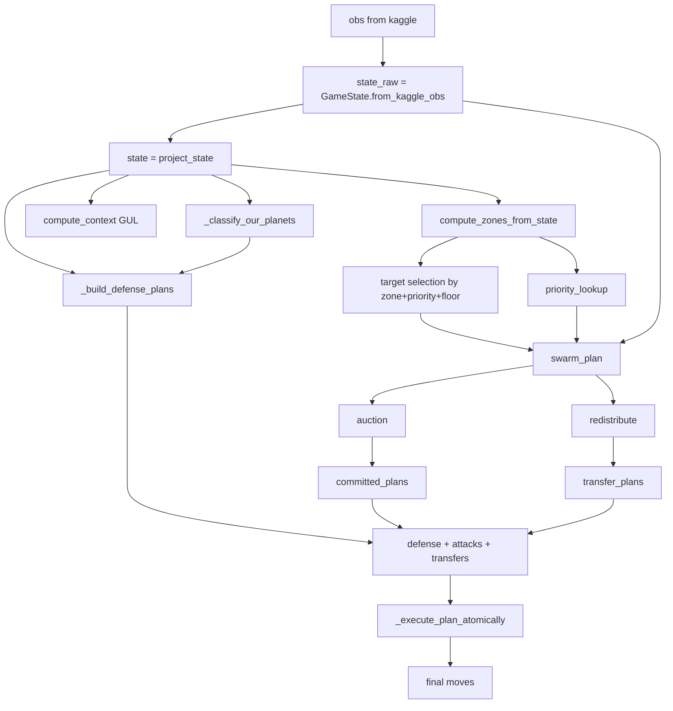
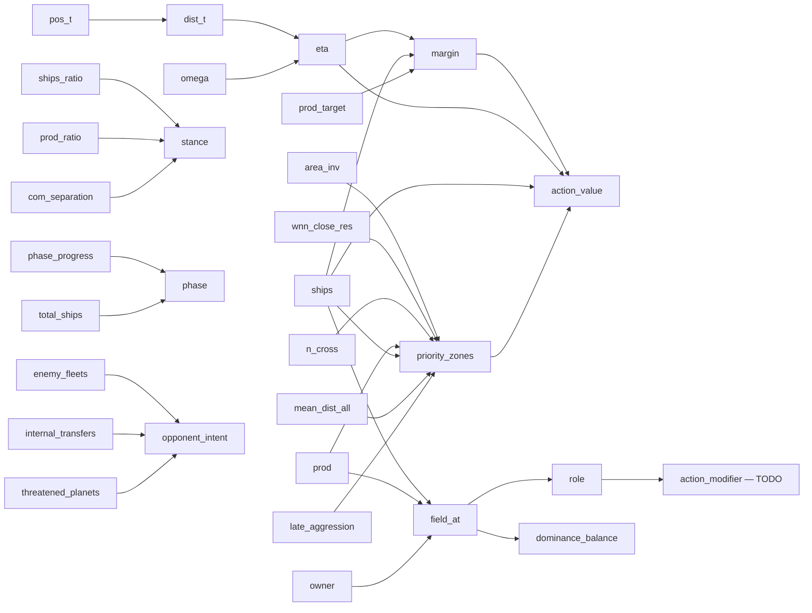

# Граф зависимостей фич

Кликабельные ссылки на разделы (Obsidian: hover → preview).

## Поток данных в одном ходе

## Феатурные цепочки

## Ключевые точки расширения (где интегрировать новое)

- `_action_value` ([[70_swarm_decisions#action-value]]) — самая частая точка
  расширения. Любая новая фича → может стать модификатором.
- `compute_zones_from_state` ([[60_zones_priority]]) — meta-priority, влияет
  на target selection.
- `compute_context` ([[50_gul_context]]) — глобальная сводка, потенциал для
  условных весов.

## Логика обновления каталога

Когда меняем код:
- Новая константа в `swarm.py` → [[70_swarm_decisions#swarmweights]].
- Новая метрика в `zones.py` → [[60_zones_priority#что-считаем]].
- Новое поле в `GameContext` → [[50_gul_context]].
- Новый тип action → [[40_action_plans]].
- Новая физическая фича (sun, angle, ETA) → [[30_pairs]].
